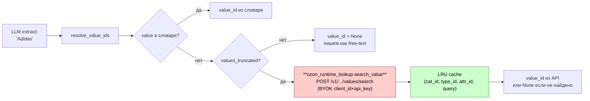

# Marketplace Strategy + словари характеристик

Перед запуском основного pipeline (стадии 0–4) мы пропускаем targets (список характеристик которые нужно заполнить) через **MarketplaceStrategy**. Цель — отрубить характеристики которых нет в catalog маркетплейса, обогатить остальные authoritative-метаданными (точное имя, тип значения, флаг массива, допустимые варианты для enum-полей), а после извлечения — превратить строковые значения в `value_id` которые маркетплейс ждёт в своём API.

Без этого слоя ИИ может «придумать» характеристику или вернуть значение которое маркетплейс отвергнет при загрузке карточки.

---

## Как это вписано в общий поток

```mermaid
flowchart TD
    In([Запрос от addon: product + category_id + marketplace + ozon_type_id]) --> CTX
    CTX["**ExtractionContext**<br/>marketplace, category_id,<br/>ozon_type_id, product_name,<br/>description, image_urls, ..."]
    CTX --> FACT
    FACT["**Strategy Factory**<br/>get_strategy(ctx.marketplace)"]
    FACT -->|marketplace=ozon| OZS["OzonStrategy"]
    FACT -->|marketplace=wb| WBS["WildberriesStrategy<br/>⏸ pending dictionary"]
    FACT -->|unknown / null| DEF["DefaultStrategy<br/>no-op pass-through"]
    
    OZS --> STEP0B
    WBS --> STEP0B
    DEF --> STEP0B
    
    STEP0B["**Шаг 0b: filter_by_dictionary**<br/>strategy.filter_by_dictionary(targets, ctx)<br/>→ выкидывает characteristics<br/>которых нет в словаре маркетплейса"]
    STEP0B --> STEP0C
    
    STEP0C["**Шаг 0c: normalize_target_with_context**<br/>для каждого target из словаря тянем:<br/>• name (официальный)<br/>• type (String/Integer/Decimal/Boolean/URL)<br/>• is_collection (массив значений?)<br/>• allowed_values для enum-полей<br/>• description"]
    STEP0C --> PIPE
    
    PIPE["**Pipeline стадии 0–4**<br/>(описание → знания → vision → web)<br/>работают уже с обогащёнными targets:<br/>видят allowed_values + is_collection в промпте,<br/>возвращают строки или массивы строк"]
    PIPE --> MERGE
    
    MERGE["**Merge AttributeValues**<br/>по каждому attribute_id берётся<br/>значение с максимальной уверенностью"]
    MERGE --> STEP_RV
    
    STEP_RV["**Шаг resolve_value_ids в _finalize**<br/>для каждого AttributeValue:<br/>1. ищем в словаре match строки → value_id<br/>2. если miss + values_truncated=true →<br/>   runtime_lookup через Ozon API<br/>3. для is_collection — список value_ids"]
    STEP_RV --> Out([Заполненные характеристики:<br/>{value, value_id, is_collection, evidence, source}])
    
    style FACT fill:#ffe,stroke:#cc3,color:#000
    style OZS fill:#cfc,stroke:#393,color:#000
    style WBS fill:#fec,stroke:#c93,color:#000
    style DEF fill:#eee,stroke:#999,color:#000
    style STEP0B fill:#cde,stroke:#369,color:#000
    style STEP0C fill:#cde,stroke:#369,color:#000
    style STEP_RV fill:#cde,stroke:#369,color:#000
    style PIPE fill:#fcf,stroke:#939,color:#000
```

---

## Что лежит в словарях

Словарь — это один файл на диске, грузим лениво один раз на процесс (`functools.lru_cache(maxsize=1)`), дальше всё в памяти за O(1).

### Ozon (`data/ozon_dictionary.json.gz`, **137 MB**)

Источник: официальный **Ozon Seller API**:
- `/v1/description-category/tree` — дерево категорий
- `/v1/description-category/attribute` — характеристики по `(cat_id, type_id)`
- `/v1/description-category/attribute/values` — допустимые значения для dict-backed атрибутов

Файл лежит gzipped (`.json.gz`) — это 92% компрессия (1.7 GB → 137 MB). Loader прозрачно открывает `gzip.open(...)`.

```json
{
  "schema_version": 2,
  "source": "ozon_seller_api",
  "generated_at": "2026-05-20",
  "values_enriched_at": "2026-05-20",
  "categories": {
    "<description_category_id>:<type_id>": {
      "description_category_id": 17027949,
      "type_id": 95001,
      "name": "Кроссовки",
      "path": ["Обувь", "Кроссовки и кеды", "Кроссовки"],
      "characteristics": [
        {
          "id": 9024,
          "name": "Основной цвет",
          "type": "String",
          "is_required": true,
          "is_collection": false,
          "description": "Базовый цвет товара",
          "values": [
            {"id": 61576, "value": "Синий"},
            {"id": 61577, "value": "Тёмно-синий"},
            {"id": 61578, "value": "Тёмно-серый"}
          ]
        },
        {
          "id": 85,
          "name": "Бренд",
          "type": "String",
          "is_required": true,
          "is_collection": false,
          "description": "Производитель товара",
          "values_truncated": true
        }
      ]
    }
  }
}
```

**Цифры**:
- **9 227** leaf type IDs (полная номенклатура категорий)
- **343 356** характеристик в сумме
- **7 288** уникальных `attribute_id` (values шарятся между категориями — фетчим один раз)
- **110 774** характеристики обогащены `values` (~32% от всех — это dict-backed enums типа цветов, стран, материалов)
- **10 895** характеристик с `values_truncated: true` (бренды, модели, города — у них >5000 значений; не храним полный список, fallback в runtime_lookup)

### Wildberries (`data/wb_dictionary.json.gz`, ⏸ pending)

Не построен. Два пути:

1. **Content API** для поставщика (быстро, authoritative) — нужен seller-кабинет (5–10к взнос на WB).
2. **HuggingFace `nyuuzyou/wb-products` + basket-CDN** (бесплатно, ~5 часов) — 80–95% покрытие subjects, частичное покрытие optional характеристик.

Сейчас выбран путь №1 — ждём seller-кабинет.

---

## Runtime lookup для truncated dictionaries

Бренды, модели, города — у Ozon у этих характеристик миллионы значений, не поместишь в файл. Сохраняем только флаг `values_truncated: true` и dose-on-demand:



Кэш живёт в памяти процесса — одна и та же пара `(attr_id, "Adidas")` дёргает API только при первом запросе.

---

## Поддержка массивов значений (`is_collection`)

Некоторые характеристики Ozon принимают **несколько** значений сразу (например, «Совместимые модели» → массив строк). Флаг `is_collection: true` в словаре.

Цепочка:

1. `OzonStrategy.normalize_target_with_context` тянет `is_collection` из словаря в `TargetAttribute.is_collection`.
2. Sources (Description/Knowledge/Vision/WebSearch) видят `is_collection=true` в промпте → инструкция LLM «верни JSON массив».
3. `AttributeValue.value` — `Union[scalar, list[scalar]]`. Pydantic схема принимает оба варианта.
4. `resolve_value_ids` мапит элементы массива в `value_ids: list[int]` (вместо одиночного `value_id`).

---

## Где это в коде

| Файл | Роль |
|---|---|
| `app/services/enrichment/base.py` | `ExtractionContext` (marketplace, ozon_type_id), `AttributeValue` (value/value_id/value_ids/is_collection), `TargetAttribute` (is_collection) |
| `app/services/enrichment/pipeline.py` | `PipelineOrchestrator.enrich` — шаги 0b filter + 0c normalize, `_finalize` — resolve_value_ids |
| `app/services/enrichment/pipeline_adapter.py` | Точка входа из job_processor — прокидывает `marketplace` в context |
| `app/services/enrichment/strategies/base.py` | Абстрактный `MarketplaceStrategy` с no-op `filter_by_dictionary` / `normalize_target_with_context` / `resolve_value_ids` |
| `app/services/enrichment/strategies/factory.py` | `get_strategy(name)` — диспатч ozon/wb/default |
| `app/services/enrichment/strategies/ozon_strategy.py` | Реальный OzonStrategy + async `resolve_value_ids_async` с runtime_lookup fallback |
| `app/services/enrichment/strategies/wildberries_strategy.py` | Заглушка, ждёт dictionary |
| `app/services/enrichment/strategies/default_strategy.py` | No-op для не-WB/Ozon |
| `app/services/enrichment/strategies/dictionaries/ozon_loader.py` | `lru_cache`-singleton; читает `.json.gz` через gzip; `get_ozon_characteristics_for_type` / `resolve_value_id` / `is_truncated` |
| `app/services/enrichment/strategies/dictionaries/ozon_runtime_lookup.py` | Async `search_value` через Ozon API + in-process кэш |
| `app/services/enrichment/sources/*.py` | Каждый source знает про `is_collection` и инструктирует LLM возвращать массив |
| `scripts/build_ozon_dictionary_via_api.py` | Парсер дерева категорий + базовых атрибутов |
| `scripts/build_ozon_values.py` | Парсер допустимых значений для dict-backed атрибутов |
| `scripts/shrink_ozon_dictionary.py` | Дропает values где `values_truncated=true` + жмёт gzip |

Файлы `data/*.json` и `*.json.gz` **в gitignore** — собираем при деплое скриптами (большие, легко регенерятся).

---

## Что отвалится без этого слоя

Без `filter_by_dictionary`:
- ИИ может вернуть характеристику с `attribute_id` которого у этой категории нет → 400 при загрузке карточки на маркетплейс.

Без `normalize_target_with_context`:
- ИИ видит сырое имя характеристики из CS-Cart (например, «Цвет товара» вместо официального «Основной цвет, согласно палитре Ozon») и плохо мапится в правильный термин.
- Для enum-полей ИИ выбирает свободное значение («Тёмно-синий») вместо одного из допустимых вариантов словаря с конкретными ID.
- Для коллекций ИИ возвращает строку «красный, синий» вместо массива `["Красный", "Синий"]`.

Без `resolve_value_ids`:
- В Ozon API уходит строка «Adidas», а маркетплейс ждёт `value_id=971042156`. Карточка отклоняется на этапе валидации.

Без `runtime_lookup`:
- Truncated dictionaries (бренды, модели) не резолвятся → весь бренд-extraction практически бесполезен.

Поэтому все четыре шага — обязательная часть pipeline для маркетплейсов с строгой валидацией значений.

---

## Conditional attributes — backlog

В текущем словаре Ozon **нет** информации о зависимостях между характеристиками (например, «российский размер обуви» зависит от «возрастная категория»). Endpoint `/v1/description-category/attribute` который мы используем не возвращает `attribute_complex_id`. Чтобы их добавить — нужно переэкстрактить словарь через `/v1/description-category/attribute-extended` + написать dependency-resolution логику. **Пока пунктовано в backlog** — для MVP не блокер, Ozon просто отклонит карточку с конкретной ошибкой и addon её отрапортует.
