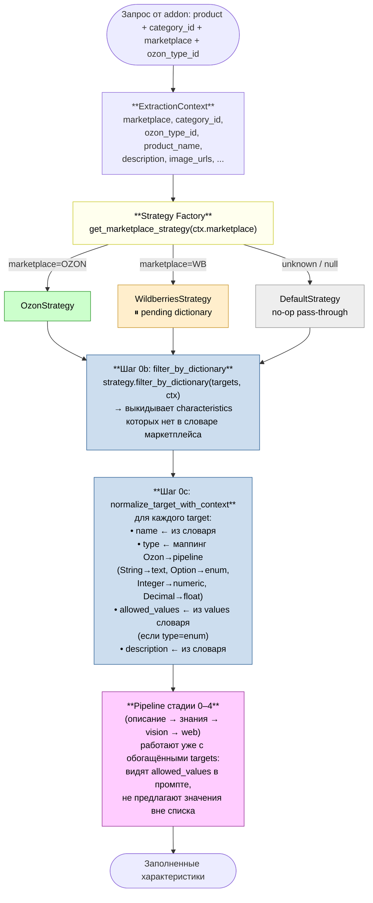

# Marketplace Strategy + словари характеристик

Перед запуском основного pipeline (стадии 0–4) мы пропускаем targets (список характеристик которые нужно заполнить) через **MarketplaceStrategy**. Цель — отрубить характеристики которых нет в catalog маркетплейса, и обогатить остальные authoritative-метаданными (точное имя, тип значения, допустимые варианты для enum-полей).

Без этого слоя ИИ может «придумать» характеристику или вернуть значение которое маркетплейс отвергнет при загрузке карточки.

---

## Как это вписано в общий поток



---

## Что лежит в словарях

Один словарь = один JSON-файл на диске. Загружается лениво в память один раз на процесс (`functools.lru_cache(maxsize=1)`), потом запросы — это O(1) lookup в dict.

### Ozon (`data/ozon_dictionary.json`, ~203MB → ~250MB с values)

Источник: официальный **Ozon Seller API** (`/v1/description-category/tree` + `/v1/description-category/attribute` + `/v1/description-category/attribute/values`).

```json
{
  "schema_version": 2,
  "source": "ozon_seller_api",
  "generated_at": "2026-05-20",
  "categories": {
    "<description_category_id>:<type_id>": {
      "description_category_id": 17027949,
      "type_id": 95001,
      "name": "Кроссовки",
      "path": ["Обувь", "Кроссовки и кеды", "Кроссовки"],
      "characteristics": [
        {
          "id": 85,
          "name": "Бренд",
          "type": "String",
          "is_required": true,
          "is_collection": false,
          "description": "Производитель товара",
          "values": [
            {"id": 971042156, "value": "Adidas"},
            {"id": 971042157, "value": "Nike"},
            ...
          ]
        },
        ...
      ]
    },
    ...
  }
}
```

- **9 227** leaf type IDs (полная номенклатура)
- **343 356** характеристик
- **values** подтягиваются отдельным проходом только для dict-backed атрибутов (~20% от уникальных attribute_id). Очень большие словари (бренды с миллионами значений, модели) обрезаются на 5000 значений с пометкой `values_truncated: true`.

### Wildberries (`data/wb_dictionary.json`, ⏸ pending)

Пока не построен. Два пути:

1. **Content API** для поставщика (быстро, authoritative) — нужен seller-кабинет (5–10к взнос).
2. **HuggingFace `nyuuzyou/wb-products` + basket-CDN** (бесплатно, ~5 часов) — 80–95% покрытие subjects, частичное покрытие optional характеристик.

Сейчас планируем путь №1 как только будет кабинет.

---

## Где это в коде

| Файл | Роль |
|---|---|
| `app/services/enrichment/strategies/base.py` | Абстрактный `MarketplaceStrategy` с дефолтными no-op реализациями `filter_by_dictionary` и `normalize_target_with_context` |
| `app/services/enrichment/strategies/ozon_strategy.py` | OzonStrategy — реальная реализация с lookup в ozon_dictionary |
| `app/services/enrichment/strategies/wildberries_strategy.py` | WildberriesStrategy — структура есть, dictionary ждёт |
| `app/services/enrichment/strategies/default_strategy.py` | Fallback для неизвестных marketplace |
| `app/services/enrichment/strategies/factory.py` | `get_marketplace_strategy(marketplace)` — диспатч |
| `app/services/enrichment/strategies/dictionaries/ozon_loader.py` | Загрузчик с `lru_cache`, lookup по `(cat_id, type_id)` |
| `app/services/enrichment/strategies/dictionaries/data/ozon_dictionary.json` | Сам словарь |
| `app/services/enrichment/pipeline.py` | Шаги 0b и 0c вписаны в `PipelineOrchestrator.enrich()` |
| `app/services/enrichment/pipeline_adapter.py` | Точка входа — принимает `marketplace`, прокидывает в context |
| `scripts/build_ozon_dictionary_via_api.py` | Парсер дерева категорий + атрибутов |
| `scripts/build_ozon_values.py` | Парсер допустимых значений для enum-атрибутов |

---

## Что отвалится без этого слоя

Без `filter_by_dictionary`:
- ИИ может вернуть характеристику с `attribute_id` которого у этой категории нет → 400 при загрузке карточки на маркетплейс.

Без `normalize_target_with_context`:
- ИИ видит сырое имя характеристики из CS-Cart (например, «Цвет товара» вместо официального «Основной цвет, согласно палитре Ozon») и плохо мапится в правильный термин.
- Для enum-полей ИИ выбирает свободное значение («Тёмно-синий») вместо одного из допустимых вариантов словаря («Синий», «Тёмно-синий», «Тёмно-серый» с конкретными ID).

Поэтому шаги 0b и 0c — обязательная преамбула перед любым LLM-вызовом в pipeline.
