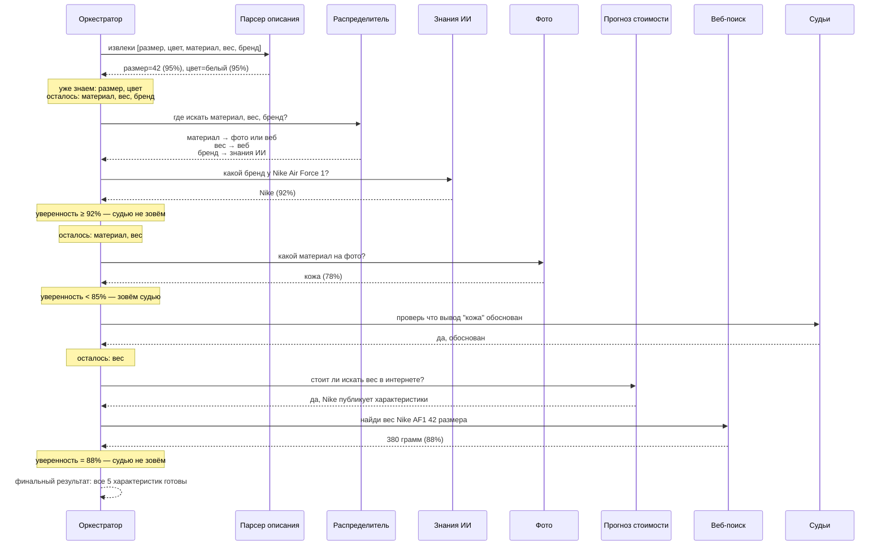

# Главный pipeline обработки товара

Когда селлер отправляет товар на заполнение характеристик, он проходит через цепочку этапов. Каждый этап что-то узнаёт о товаре, и после каждого мы проверяем — а нужны ли вообще следующие. Если уже всё нашли — останавливаемся и не тратим ни время, ни деньги на ИИ.

## Главные правила

1. **Один этап = одно обращение к ИИ.** Никаких огромных промптов где мы скармливаем всё подряд одним вызовом. Каждый вызов делает ровно одну задачу.
2. **Этапы идут по очереди, не параллельно.** Это важно: после каждого этапа мы смотрим что уже знаем и решаем — а нужно ли вообще запускать следующий. Параллельный запуск всех этапов был бы расточительным.
3. **Учитываем стоимость.** Перед самыми дорогими этапами (фото и поиск в интернете) ИИ-помощник сначала проверяет — а есть ли смысл туда лезть.
4. **У каждого этапа свой судья.** Когда ИИ извлёк характеристику, мы не доверяем ему слепо — другой ИИ-судья проверяет результат. Но если первый ИИ сам сказал «я на 90%+ уверен» — судью пропускаем, экономим.
5. **Каждая характеристика идёт своим путём.** Сначала ИИ-распределитель решает: размер кроссовок — это где смотреть, цвет — где, вес — где. И запускаем нужные этапы только для нужных характеристик.

---

## Большая схема всего pipeline

```mermaid
flowchart TD
    Start([На входе: товар + список характеристик которые нужно заполнить]) --> SMP
    
    SMP["**Шаги 0b + 0c: MarketplaceStrategy**<br/>(для Ozon/WB; для остальных no-op)<br/>0b filter_by_dictionary — выкидывает<br/>характеристики которых нет в справочнике маркетплейса<br/>0c normalize_target_with_context —<br/>обогащает name/type/allowed_values/is_collection<br/>из официального словаря Ozon/WB<br/><br/>Подробнее: marketplace-strategy.md"]
    SMP --> S0
    
    S0["**Этап 0: Парсер описания**<br/>(существующий ai_pipeline)<br/>1-4 обращения к ИИ<br/>→ характеристики которые нашлись в описании<br/>+ уверенность по каждой"]
    S0 --> CovA{Все нужные<br/>характеристики<br/>заполнены?}
    CovA -->|да| FINAL
    CovA -->|нет| S1
    
    S1["**Этап 1: ИИ-распределитель**<br/>1 обращение к ИИ<br/>Для каждой ненайденной характеристики:<br/>где её лучше искать?<br/>→ {характеристика → [варианты источников]}"]
    S1 --> S2
    
    S2["**Этап 2: ИИ из памяти модели**<br/>1 обращение к ИИ<br/>(только для характеристик которые<br/>распределитель пометил как 'знание модели')<br/>→ характеристики + уверенность"]
    S2 --> J2{Уверенность<br/>≥ 92%?}
    J2 -->|да| S2_DONE[Доверяем]
    J2 -->|нет| JUDGE2["Судья знаний<br/>1 обращение к ИИ"]
    JUDGE2 --> S2_DONE
    S2_DONE --> CovB{Всё заполнено?}
    CovB -->|да| FINAL
    CovB -->|нет| S3GATE
    
    S3GATE{Есть ли фото товара<br/>И ещё остались<br/>'визуальные' характеристики?}
    S3GATE -->|нет| S4GATE
    S3GATE -->|да| S3
    
    S3["**Этап 3: Анализ фото (Vision)**<br/>1) ИИ смотрит фото и описывает что видит — 1 обращение<br/>2) Из описания извлекаем характеристики — 1 обращение"]
    S3 --> J3{Уверенность<br/>≥ 85%?}
    J3 -->|да| S3_DONE[Доверяем]
    J3 -->|нет| JUDGE3["Судья фото<br/>1 обращение к ИИ"]
    JUDGE3 --> S3_DONE
    S3_DONE --> CovC{Всё заполнено?}
    CovC -->|да| FINAL
    CovC -->|нет| S4GATE
    
    S4GATE["**Прогноз стоимости**<br/>1 обращение к ИИ<br/>Стоит ли вообще искать в интернете<br/>про этот конкретный товар?"]
    S4GATE --> S4DEC{Стоит?}
    S4DEC -->|нет| FINAL
    S4DEC -->|да| S4
    
    S4["**Этап 4: Поиск в интернете**<br/>1) ИИ с инструментом web_search ищет и собирает текст — 1 обращение<br/>2) Из найденного извлекаем характеристики — 1 обращение"]
    S4 --> J4{Уверенность<br/>≥ 88%?}
    J4 -->|да| S4_DONE[Доверяем]
    J4 -->|нет| JUDGE4["Судья веб-поиска<br/>1 обращение к ИИ"]
    JUDGE4 --> S4_DONE
    S4_DONE --> FINAL
    
    FINAL["**Объединение результатов**<br/>Для каждой характеристики выбираем<br/>вариант с наибольшей уверенностью.<br/>При равной уверенности приоритет:<br/>Описание > Фото > Веб > Знания модели"]
    FINAL --> RV["**resolve_value_ids** (для Ozon/WB)<br/>Строковые значения → value_id<br/>из словаря или runtime API.<br/>Для is_collection — список value_ids"]
    RV --> Out([На выходе: характеристики с value + value_id + источник])
    
    style SMP fill:#cde,stroke:#369,color:#000
    style S0 fill:#cde,stroke:#369,color:#000
    style S1 fill:#fec,stroke:#c93,color:#000
    style S2 fill:#cfc,stroke:#393,color:#000
    style S3 fill:#fcf,stroke:#939,color:#000
    style S4 fill:#fcc,stroke:#933,color:#000
    style S3GATE fill:#ffe,stroke:#cc3,color:#000
    style S4GATE fill:#ffe,stroke:#cc3,color:#000
    style JUDGE2 fill:#eef,stroke:#669,color:#000
    style JUDGE3 fill:#eef,stroke:#669,color:#000
    style JUDGE4 fill:#eef,stroke:#669,color:#000
    style RV fill:#cde,stroke:#369,color:#000
```



---

## Как это работает на реальном примере

Возьмём кроссовки «Nike Air Force 1 размер 42». В карточке есть описание «Классические кожаные кроссовки», есть фото. Нужно заполнить: размер, цвет, материал, вес, бренд.



**Сколько обращений к ИИ сделано:**
- Парсер описания: ~3
- Распределитель: 1
- Знания ИИ: 1
- Фото (описание + извлечение + судья): 3
- Прогноз стоимости: 1
- Веб (поиск + извлечение): 2
- **Итого: ~11 обращений на товар**

В разных сценариях это число будет разным — подробный расчёт в [cost-breakdown.md](cost-breakdown.md).

---

## Карта классов (как код устроен)

```mermaid
classDiagram
    class AttributeSource {
        <<абстрактный>>
        +Source source_type
        +float confidence_threshold
        +async extract(товар, характеристики) AttributeValue[]
        +get_judge() LlmJudge
    }
    
    class AttributeValue {
        +int attribute_id
        +Any value (значение)
        +float confidence (уверенность)
        +Source source (откуда)
        +Optional~str~ evidence (обоснование)
        +bool judge_validated (проверено судьёй)
    }
    
    class DescriptionSource {
        обёртка над существующим ai_pipeline
        порог уверенности 95%
    }
    
    class LlmKnowledgeSource {
        спрашиваем ИИ из его памяти
        порог уверенности 92%
    }
    
    class VisionSource {
        анализ фотографий товара
        порог уверенности 85%
    }
    
    class WebSearchSource {
        поиск в интернете
        порог уверенности 88%
    }
    
    class LlmJudge {
        <<абстрактный>>
        +async validate(значение, товар) bool
    }
    
    class LlmClassifier {
        ИИ-распределитель
        +async classify(ненайденные_атрибуты, товар)
    }
    
    class CostPredictor {
        ИИ-прогнозист стоимости
        +async is_web_search_worth(товар, атрибуты) bool
    }
    
    class PipelineOrchestrator {
        главный дирижёр всего pipeline
        +async fill(товар, характеристики) AttributeValue[]
    }
    
    class ConfidenceAwareJudgeWrapper {
        обёртка которая решает звать судью или нет
        +async maybe_validate(значение) AttributeValue
    }
    
    AttributeSource <|-- DescriptionSource
    AttributeSource <|-- LlmKnowledgeSource
    AttributeSource <|-- VisionSource
    AttributeSource <|-- WebSearchSource
    AttributeSource o-- LlmJudge
    PipelineOrchestrator *-- DescriptionSource
    PipelineOrchestrator *-- LlmKnowledgeSource
    PipelineOrchestrator *-- VisionSource
    PipelineOrchestrator *-- WebSearchSource
    PipelineOrchestrator *-- LlmClassifier
    PipelineOrchestrator *-- CostPredictor
```



---

## Где какие файлы будут лежать

```
app/services/enrichment/
├── base.py                    Базовые типы: AttributeSource, AttributeValue, Source, интерфейс судьи
├── pipeline.py                Оркестратор — главный дирижёр, запускает этапы по порядку
│
├── sources/                   Источники характеристик — по одному классу на каждый
│   ├── description_source.py
│   ├── llm_knowledge_source.py
│   ├── vision_source.py
│   └── websearch_source.py
│
├── producers/                 Уже сделано первым агентом
│   ├── vision_producer.py     (Описывает фото текстом)
│   └── websearch_producer.py  (Ищет в интернете и возвращает текст)
│
├── intelligence/              ИИ-агенты которые принимают решения
│   ├── classifier.py          Распределитель: куда какую характеристику направить
│   └── cost_predictor.py      Прогнозист: стоит ли запускать веб-поиск
│
└── judges/                    Судьи — у каждого источника свой
    ├── base_judge.py
    ├── description_judge.py
    ├── vision_judge.py
    ├── websearch_judge.py
    └── knowledge_judge.py
```

---

## Пороги уверенности для каждого источника

| Источник | Порог | Почему такой |
|---|---|---|
| Парсер описания | 95% | Самый надёжный — описание про конкретный товар от селлера. Очень редко промахиваемся |
| Знания ИИ из памяти | 92% | ИИ может выдумывать (галлюцинировать), поэтому строже к нему |
| Анализ фото | 85% | Фото обычно показывают характеристику явно — порог низкий, чаще доверяем |
| Веб-поиск | 88% | Зависит от качества источников в интернете — средний порог |

Если уверенность ИИ ниже порога — зовём специального судью именно для этого источника (у него промпт заточен под типичные ошибки этого источника).

---

## Как объединяем результаты (merge)

Может получиться так, что одну характеристику нашли несколько этапов: например, материал нашёлся и по фото (кожа, уверенность 78%) и в веб-поиске (натуральная кожа, уверенность 90%). Какой вариант выбрать?

```python
def merge(результаты_всех_источников):
    """
    Для каждой характеристики берём вариант с наибольшей уверенностью.
    Если уверенность одинаковая — приоритет по источнику:
      Описание > Фото > Веб > Знания ИИ
    """
```

Почему такой приоритет источников при равной уверенности? От самого «привязанного к конкретному товару» к самому общему:

- **Описание** — конкретно про этот товар от селлера, самое релевантное
- **Фото** — конкретно про этот товар, но визуально (может не быть видно деталей)
- **Веб-поиск** — про этот товар или аналог, но из внешних источников
- **Знания ИИ** — общие знания о категории, наименее привязанные

В нашем примере с материалом победит веб (90% > 78%), даже несмотря на то что фото — выше по приоритету. Уверенность важнее при разнице.
