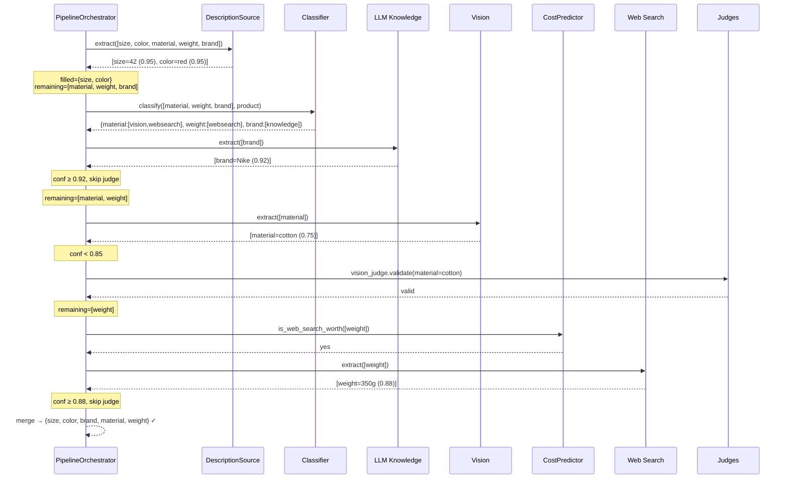

# Pipeline architecture

Главный extraction pipeline. **Sequential, cost-aware, per-attribute routing**.

## Правила

1. **1 stage = 1 LLM call.** Никаких мега-промптов.
2. **Sequential, не parallel.** Каждая стадия видит результат предыдущей и решает нужна ли вообще.
3. **Cost-aware:** перед expensive (vision, web search) — coverage check + cost predictor.
4. **Per-source judge:** у каждого source свой LLM judge. Skip judge если confidence ≥ source threshold.
5. **Per-attribute routing:** LLM Classifier раз в начале решает где какой attr искать.

---

## Высокоуровневый flowchart

```mermaid
flowchart TD
    Start([Input: product + target_attrs]) --> S0
    
    S0["**Stage 0: DescriptionSource**<br/>(existing ai_pipeline 4-stage)<br/>1-4 LLM calls<br/>→ attrs_with_confidence"]
    S0 --> CovA{All target<br/>attrs filled?}
    CovA -->|yes| FINAL
    CovA -->|no| S1
    
    S1["**Stage 1: LlmClassifier**<br/>1 LLM call<br/>For each unfilled attr → where to look?<br/>Output: {attr_id → [knowledge, vision, websearch]}"]
    S1 --> S2
    
    S2["**Stage 2: LlmKnowledgeSource**<br/>1 LLM call<br/>(only for attrs tagged 'knowledge')<br/>→ attrs + confidence per attr"]
    S2 --> J2{conf ≥ 0.92?}
    J2 -->|yes| S2_DONE[Trust value]
    J2 -->|no| JUDGE2["knowledge_judge<br/>1 LLM call"]
    JUDGE2 --> S2_DONE
    S2_DONE --> CovB{All filled?}
    CovB -->|yes| FINAL
    CovB -->|no| S3GATE
    
    S3GATE{image_urls present<br/>AND vision-tagged<br/>attrs remain?}
    S3GATE -->|no| S4GATE
    S3GATE -->|yes| S3
    
    S3["**Stage 3: VisionSource**<br/>VisionProducer (1 LLM call)<br/>→ vision text<br/>+ extraction (1 LLM call)<br/>→ attrs + confidence"]
    S3 --> J3{conf ≥ 0.85?}
    J3 -->|yes| S3_DONE[Trust value]
    J3 -->|no| JUDGE3["vision_judge<br/>1 LLM call"]
    JUDGE3 --> S3_DONE
    S3_DONE --> CovC{All filled?}
    CovC -->|yes| FINAL
    CovC -->|no| S4GATE
    
    S4GATE["**CostPredictor**<br/>1 LLM call<br/>Worth web-searching this product?"]
    S4GATE --> S4DEC{worth_it?}
    S4DEC -->|no| FINAL
    S4DEC -->|yes| S4
    
    S4["**Stage 4: WebSearchSource**<br/>WebSearchProducer w/ web_search tool (1 LLM call)<br/>→ websearch text<br/>+ extraction (1 LLM call)<br/>→ attrs + confidence"]
    S4 --> J4{conf ≥ 0.88?}
    J4 -->|yes| S4_DONE[Trust value]
    J4 -->|no| JUDGE4["websearch_judge<br/>1 LLM call"]
    JUDGE4 --> S4_DONE
    S4_DONE --> FINAL
    
    FINAL["**Merge**<br/>highest confidence per attr<br/>tie-break: DESCRIPTION > VISION > WEBSEARCH > KNOWLEDGE"]
    FINAL --> Out([Output: filled_attrs + audit_trail])
    
    style S0 fill:#cde,stroke:#369,color:#000
    style S1 fill:#fec,stroke:#c93,color:#000
    style S2 fill:#cfc,stroke:#393,color:#000
    style S3 fill:#fcf,stroke:#939,color:#000
    style S4 fill:#fcc,stroke:#933,color:#000
    style S3GATE fill:#ffe,stroke:#cc3,color:#000
    style S4GATE fill:#ffe,stroke:#cc3,color:#000
    style JUDGE2 fill:#eef,stroke:#669,color:#000
    style JUDGE3 fill:#eef,stroke:#669,color:#000
    style JUDGE4 fill:#eef,stroke:#669,color:#000
```



---

## Sequence diagram: типичный случай

Товар: «Nike Air Force 1 размер 42». Description есть но неполное. Image_urls есть. Target attrs: `[size, color, material, weight, brand]`.



**Сколько LLM calls:** Description (~3 stage calls) + Classifier (1) + Knowledge (1) + Vision producer (1) + Vision extraction (1) + Vision judge (1) + CostPredictor (1) + WebSearch producer (1) + WebSearch extraction (1) = **~11 calls**.

---

## Class diagram

```mermaid
classDiagram
    class AttributeSource {
        <<abstract>>
        +Source source_type
        +float confidence_threshold
        +async extract(product, target_attrs) AttributeValue[]
        +get_judge() LlmJudge
    }
    
    class AttributeValue {
        +int attribute_id
        +Any value
        +float confidence
        +Source source
        +Optional~str~ evidence
        +bool judge_validated
    }
    
    class DescriptionSource {
        +ai_pipeline existing
        +threshold 0.95
    }
    
    class LlmKnowledgeSource {
        +llm_manager
        +threshold 0.92
    }
    
    class VisionSource {
        +vision_producer
        +threshold 0.85
    }
    
    class WebSearchSource {
        +websearch_producer
        +threshold 0.88
    }
    
    class LlmJudge {
        <<abstract>>
        +async validate(value, product) bool
    }
    
    class LlmClassifier {
        +async classify(unfilled_attrs, product)
    }
    
    class CostPredictor {
        +async is_web_search_worth(product, attrs) bool
    }
    
    class PipelineOrchestrator {
        +description_source
        +classifier
        +knowledge_source
        +vision_source
        +websearch_source
        +cost_predictor
        +async fill(product, target_attrs) AttributeValue[]
    }
    
    class ConfidenceAwareJudgeWrapper {
        +judge
        +threshold
        +async maybe_validate(value) AttributeValue
    }
    
    AttributeSource <|-- DescriptionSource
    AttributeSource <|-- LlmKnowledgeSource
    AttributeSource <|-- VisionSource
    AttributeSource <|-- WebSearchSource
    AttributeSource o-- LlmJudge
    PipelineOrchestrator *-- DescriptionSource
    PipelineOrchestrator *-- LlmKnowledgeSource
    PipelineOrchestrator *-- VisionSource
    PipelineOrchestrator *-- WebSearchSource
    PipelineOrchestrator *-- LlmClassifier
    PipelineOrchestrator *-- CostPredictor
```



---

## Файловая структура

```
app/services/enrichment/
├── base.py                    # AttributeSource ABC + AttributeValue + Source enum + judge interface
├── pipeline.py                # PipelineOrchestrator (sequential)
│
├── sources/
│   ├── description_source.py
│   ├── llm_knowledge_source.py
│   ├── vision_source.py
│   └── websearch_source.py
│
├── producers/                 ← УЖЕ есть от первого агента
│   ├── vision_producer.py
│   └── websearch_producer.py
│
├── intelligence/
│   ├── classifier.py
│   └── cost_predictor.py
│
└── judges/
    ├── base_judge.py
    ├── description_judge.py
    ├── vision_judge.py
    ├── websearch_judge.py
    └── knowledge_judge.py
```

---

## Confidence thresholds (per source)

| Source | Threshold | Обоснование |
|---|---|---|
| DescriptionSource | 0.95 | Самый надёжный — текст конкретного товара. Если LLM сомневается — judge |
| LlmKnowledgeSource | 0.92 | LLM из памяти может галлюцинировать → строже judge |
| VisionSource | 0.85 | Vision часто видит атрибут уверенно — низкая планка judge |
| WebSearchSource | 0.88 | Зависит от качества источников web |

При confidence < threshold → запускается per-source judge (специфичный промпт под failure modes этого source).

---

## Принцип merge

```python
def merge(branches: list[list[AttributeValue]]) -> list[AttributeValue]:
    """
    Для каждого attribute_id: пиксаем вариант с highest confidence.
    При равной confidence — приоритет по source:
      DESCRIPTION > VISION > WEBSEARCH > LLM_KNOWLEDGE
    """
```

Эта приоритизация отражает «насколько источник был привязан к конкретному товару»: description у нас по конкретному товару от селлера, vision — по фото этого товара, websearch — найдено в инете о товаре, knowledge — общие знания LLM.
